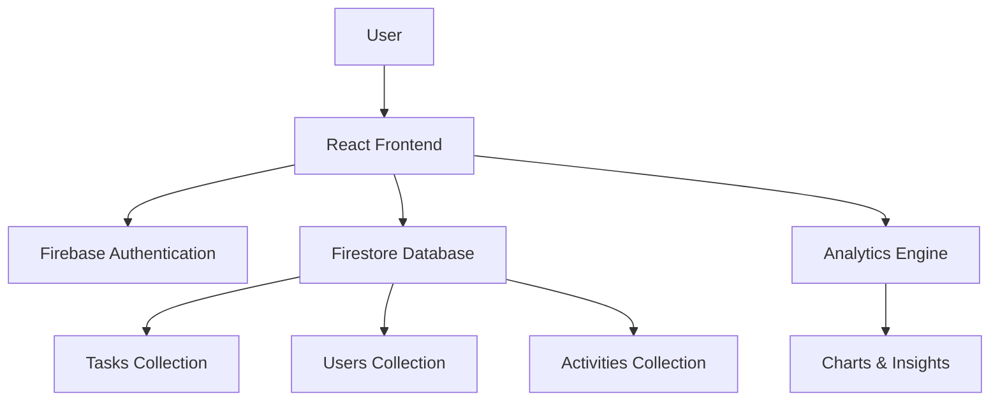
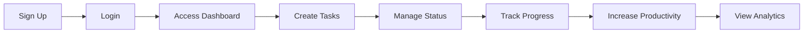

<div align="center">


<br>


<br><br>

<a href="https://task-management-dashboard-v2.web.app" target="_blank">
  
</a>


</div>

---

# ✨ Overview

Task Dashboard V2 is a modern SaaS-inspired productivity platform designed to help users organize tasks, track progress, improve productivity, and visualize performance through a premium dashboard experience.

Built using modern frontend technologies, Firebase Authentication, Firestore, Framer Motion animations, and Recharts analytics.

---

# 🎥 Dashboard Preview

<p align="center">

</p>


https://github.com/user-attachments/assets/aae7bf72-77ea-4654-98b6-cb84e117295b


---

# 📸 Screenshots

## 🌞 Light Theme


## 🌙 Dark Theme


---

# 🚀 Core Features

### 🔐 Authentication

* Firebase Authentication
* Email & Password Login
* Signup & Registration
* Password Reset
* Protected Routes

### 📋 Task Management

* Create Tasks
* Update Tasks
* Delete Tasks
* Status Updates
* Priority Levels
* Due Dates

### 🎯 Productivity System

* Daily Streak Counter
* Best Streak Tracker
* Productivity Score
* Achievement Badges
* Completion Confetti

### 📊 Analytics Dashboard

* Status Distribution Pie Chart
* Priority Analysis Bar Chart
* Productivity Trends
* Task Completion Insights

### 🎨 Premium UI/UX

* Glassmorphism Design
* Neumorphism Components
* Animated Background
* Floating Particles
* Dark / Light Mode
* Skeleton Loading States
* Empty States
* Smooth Page Transitions

---

---

# 🕘 Previous Release

## 📦 Task Dashboard V1

Task Dashboard V1 was the foundation of this project, focused on delivering a clean and responsive Kanban-style task management experience with core CRUD functionality and drag-and-drop workflow management.

### ✨ V1 Highlights

- 📝 Create, Edit & Delete Tasks
- 🎯 Task Status Management
- 🔄 Drag & Drop Kanban Board
- 🏷️ Categories & Priorities
- 📱 Fully Responsive Design
- 🌙 Dark Mode Support
- ⚡ TypeScript + Express Architecture

### 🔗 Explore Version 1

<p align="center">

<a href="[LIVE_LINK](https://task-management-dashboard-ochre.vercel.app/)">

</a>

<a href="https://github.com/ayushtripathi-45/Task_Management_Dashboard">

</a>

</p>

### 🚀 Evolution to V2

Version 2 introduces a complete SaaS-style experience with:

- 🔐 Firebase Authentication
- ☁️ Firestore Database Integration
- 📊 Productivity Analytics
- 🔥 Streak Tracking System
- 👤 Account Center
- 🎨 Premium UI/UX Design
- ⚡ Real-time Updates
- 📈 Advanced Dashboard Statistics

---


# 🛠 Tech Stack

<p align="center">


</p>

| Category       | Technology        |
| -------------- | ----------------- |
| Frontend       | React             |
| Routing        | React Router      |
| Authentication | Firebase Auth     |
| Database       | Firestore         |
| Charts         | Recharts          |
| Animations     | Framer Motion     |
| Notifications  | React Toastify    |
| Drag & Drop    | @hello-pangea/dnd |
| Icons          | React Icons       |
| Deployment     | Firebase / Vercel |

---

# 🏗 Application Architecture



---

# 🔄 User Workflow



---

# 📂 Database Structure

```txt
users/{userId}
│
├── profile
│   ├── firstName
│   ├── lastName
│   ├── username
│   ├── email
│   └── avatarLetter
│
├── stats
│   ├── currentStreak
│   ├── bestStreak
│   └── lastCompletedDate
│
└── settings
    └── theme

tasks/{taskId}
│
├── userId
├── title
├── description
├── priority
├── status
├── dueDate
├── createdAt
├── updatedAt
└── completedAt

activities/{activityId}
│
├── userId
├── action
└── timestamp
```

---

# 📊 Dashboard Modules

| Module         | Description                        |
| -------------- | ---------------------------------- |
| Home           | Landing page with project overview |
| Explore        | Feature showcase and workflow      |
| Dashboard      | Main task management workspace     |
| Analytics      | Productivity insights              |
| Account Center | User profile and activity history  |
| Settings       | Theme and account preferences      |

---

# 🔥 Dashboard Features

## 📈 Statistics Cards

* Total Tasks
* Completed Tasks
* Upcoming Tasks
* In Progress Tasks
* Productivity Score
* Current Streak

---

## 📋 Kanban Board

* Upcoming
* In Progress
* Completed

Supports:

✅ Drag & Drop

✅ Status Updates

✅ Real-time UI Refresh

✅ Search & Filters

---

## 🎯 Account Center

Displays:

* User Information
* Account Creation Date
* Total Tasks
* Productivity Percentage
* Streak Statistics
* Activity Timeline

---

# ⚙️ Environment Variables

```env
VITE_FIREBASE_API_KEY=

VITE_FIREBASE_AUTH_DOMAIN=

VITE_FIREBASE_PROJECT_ID=

VITE_FIREBASE_STORAGE_BUCKET=

VITE_FIREBASE_MESSAGING_SENDER_ID=

VITE_FIREBASE_APP_ID=
```

---

# 🚀 Local Development

### Install Dependencies

```bash
npm install
```

### Start Development Server

```bash
npm run dev
```

### Production Build

```bash
npm run build
```

---

# 🔮 Future Roadmap

### Version 2.1

* Team Collaboration
* Shared Workspaces
* User Mentions
* Task Assignment

### Version 2.5

* Calendar View
* Recurring Tasks
* Push Notifications
* Email Reminders

### Version 3.0

* AI Task Suggestions
* AI Productivity Insights
* Smart Categorization
* Voice Commands

---

# 👨‍💻 Developer

### Ayush Tripathi

B.Tech Computer Science Engineering Student

<p align="center">

<a href="https://github.com/ayushtripathi-45">

</a>

<a href="https://my-portfolio-basic-version.vercel.app/" target="_blank">
  
</a>

</p>

---

# ⭐ Support

If you find this project useful:

⭐ Star the Repository

🍴 Fork the Repository

📢 Share with Other Developers

💡 Contribute to Future Releases

---

<div align="center">


### Made with ❤️ by Ayush Tripathi

### React • Firebase • Framer Motion • Firestore

</div>
